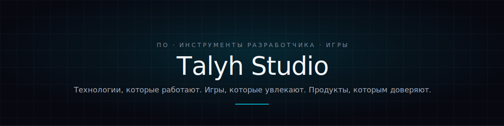

[Сайт](https://talyh.com/) · [Поддержка](mailto:support@talyh.com) · [Безопасность](mailto:security@talyh.com)

---

## Мы создаём цифровые продукты, которым доверяют

Talyh Studio разрабатывает программное обеспечение, инструменты для разработчиков и игры. Мы превращаем сложные идеи в функциональные, удобные, стабильные и увлекательные продукты, сочетая понятный дизайн с инженерной честностью.

В основе нашей работы четыре принципа:

| Принцип | Что он означает |
|---|---|
| **Качество и надёжность** | Продукты должны работать предсказуемо и оставаться сопровождаемыми в долгосрочной перспективе. |
| **Пользователь в центре** | Технологии должны решать реальные задачи без лишних препятствий. |
| **Инженерная честность** | Архитектура, ограничения, лицензирование и использование данных должны описываться понятно. |
| **Творчество и игра** | Полезные продукты могут быть выразительными, запоминающимися и приятными в использовании. |

## Что мы разрабатываем

- Настольное программное обеспечение и инструменты продуктивности.
- Расширяемые приложения с документированными интерфейсами плагинов.
- Инструменты разработчика и повторно используемые технические компоненты.
- Игры и интерактивные продукты.
- Кроссплатформенные продукты для Windows, macOS, Linux и других поддерживаемых платформ, когда это применимо.

## Модель продуктов и лицензирования

Некоторые продукты Talyh Studio используют модель бесплатного основного приложения: оно предоставляется бесплатно, а отдельные плагины и расширенные модули могут лицензироваться отдельно. Добровольная регистрация, если она предлагается, не требуется для работы основных функций, если в условиях конкретного продукта прямо не указано иное.

Для разных компонентов (приложение, плагины, зависимости) могут применяться разные лицензии — файлы `LICENSE` и `NOTICE` конкретного репозитория всегда имеют преимущество перед этим обзором. Публичные материалы ABI/API плагинов публикуются по лицензии **Apache License 2.0**, если не указано иное, — это позволяет независимым разработчикам создавать бесплатные и коммерческие плагины. Совместимость сама по себе не означает, что сторонний плагин проверен или рекомендован Talyh Studio.

## Локальная работа и конфиденциальность

Наши продукты построены на локальной обработке и минимизации данных: документы остаются на устройстве пользователя, а основное приложение не собирает имена файлов, историю редактирования, содержимое буфера обмена, поисковые запросы и рекламные идентификаторы. Собственного облачного хранилища нет, а добровольная регистрация отделена от обычной работы.

Полные версии EULA, Политики конфиденциальности и уведомлений о сторонних компонентах поставляются с каждым продуктом и также могут публиковаться на [сайте Talyh Studio](https://talyh.com/).

## Репозитории и участие в разработке

Публичные репозитории могут содержать:

- документацию продуктов и информацию о выпусках;
- публичные заголовочные файлы ABI/API плагинов и примеры;
- руководства по интеграции и демонстрационные проекты;
- отдельные инструменты и повторно используемые библиотеки с открытым исходным кодом;
- системы отслеживания задач и публичные планы, если они включены.

Перед созданием issue или pull request ознакомьтесь с файлами `README`, `CONTRIBUTING`, `SECURITY`, `LICENSE` и `NOTICE` соответствующего репозитория. Не публикуйте в открытых задачах конфиденциальные сведения, персональные данные, секреты лицензий или содержимое документов.

## Поддержка и безопасность

- Поддержка продуктов: [support@talyh.com](mailto:support@talyh.com)
- Сообщения об уязвимостях: [security@talyh.com](mailto:security@talyh.com)

Сообщайте о предполагаемых уязвимостях по закрытому каналу. Не раскрывайте неисправленную уязвимость в публичной задаче.

---

[Сайт](https://talyh.com/) · [Поддержка](mailto:support@talyh.com) · [Безопасность](mailto:security@talyh.com)

Copyright © 2026 Talyh Studio. Все права защищены.

Лицензии репозиториев не предоставляют права на использование названия, логотипа и других обозначений Talyh Studio, если это прямо не разрешено соответствующей лицензией.

